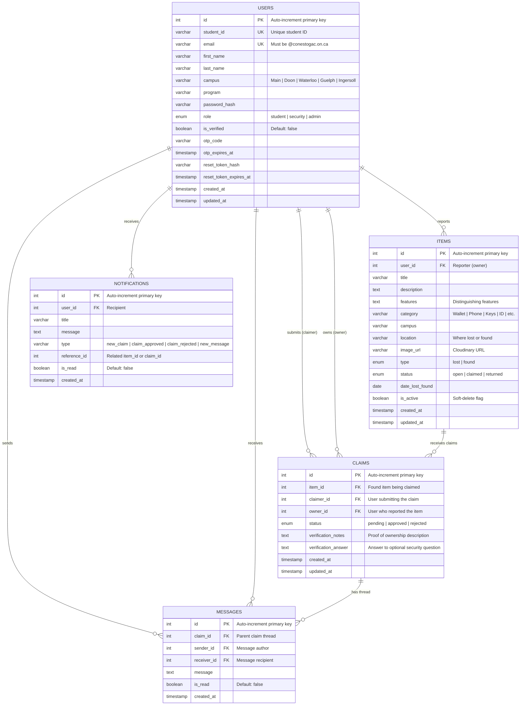

# Entity Relationship Diagram — Back2U (CampusFind)
### Iteration 2 | Team [Your Team Number]
---

## Overview

The Back2U database consists of **5 core entities**: `users`, `items`, `claims`, `messages`, and `notifications`. The diagram below shows every entity, its attributes (with data types and key constraints), and the cardinality of every relationship.

---

## ERD — Mermaid Diagram

---

## Relationships Summary

| From | To | Cardinality | Description |
|:-----|:---|:-----------:|:------------|
| `USERS` | `ITEMS` | 1 : N | A user can report many lost or found items |
| `USERS` | `CLAIMS` *(claimer)* | 1 : N | A user can submit many claims on found items |
| `USERS` | `CLAIMS` *(owner)* | 1 : N | A user can receive many claims on items they reported |
| `USERS` | `MESSAGES` *(sender)* | 1 : N | A user can send many messages across claim threads |
| `USERS` | `MESSAGES` *(receiver)* | 1 : N | A user can receive many messages |
| `USERS` | `NOTIFICATIONS` | 1 : N | A user can receive many push/in-app notifications |
| `ITEMS` | `CLAIMS` | 1 : N | A found item can receive many claims from different users |
| `CLAIMS` | `MESSAGES` | 1 : N | A claim conversation can contain many back-and-forth messages |

---

## Cardinality Legend

| Symbol | Meaning |
|:------:|:--------|
| `\|\|` | Exactly one (mandatory) |
| `o{`  | Zero or more (optional many) |
| `\|\|--o{` | One-to-many (zero or more on the right side) |

---

## Entity Descriptions

### 🧑‍🎓 USERS
Stores every registered campus user. The `role` enum distinguishes **students** (mobile app users), **security** staff (web portal only — login blocked on mobile), and **admins**. The `otp_code` / `otp_expires_at` pair supports the 3-step forgot-password OTP flow, while `reset_token_hash` / `reset_token_expires_at` secure the final password reset call.

### 📦 ITEMS
The central table for all lost and found reports. The `type` column (`lost` | `found`) separates the two report categories. The `status` column (`open` → `claimed` → `returned`) tracks lifecycle. The `is_active` flag implements soft-delete so deleted reports are never hard-removed from the database.

### 📋 CLAIMS
Created when a student believes a **found** item belongs to them. References three foreign keys: the `item_id` (item being claimed), `claimer_id` (person submitting the claim), and `owner_id` (person who reported finding it). The `status` field is updated by the owner after reviewing verification notes.

### 💬 MESSAGES
A simple conversation thread attached to a claim. Every row has both `sender_id` and `receiver_id` (both must be participants — either the claimer or the owner). Messages are ordered by `created_at` to display the chat timeline.

### 🔔 NOTIFICATIONS
In-app and push notification records tied to a user. The `type` field categorises the event (`new_claim`, `claim_approved`, `claim_rejected`, `new_message`). The `reference_id` points to the relevant `item_id` or `claim_id` to enable deep-linking from the notification to the correct screen.

---

## Key Design Decisions

| Decision | Rationale |
|:---------|:----------|
| `owner_id` stored in `CLAIMS` | Avoids a join through `ITEMS` → `USERS` to find the owner when sending notifications or loading claim details |
| Soft-delete (`is_active`) on `ITEMS` | Preserves referential integrity — existing claims and messages remain intact after a user "deletes" a report |
| Separate `MESSAGES` table | Decouples the chat thread from the claim record, allowing unlimited message history without bloating the `CLAIMS` table |
| `reference_id` (nullable int) in `NOTIFICATIONS` | Generic foreign reference — points to an item or a claim depending on `type`, avoiding multiple nullable FK columns |
| `otp_expires_at` + `reset_token_expires_at` | Time-boxed tokens prevent indefinite use of OTP codes and reset links (backend enforces expiry on verification) |

---

*Document prepared by: Team [Number] | Back2U / CampusFind | Iteration 2*
